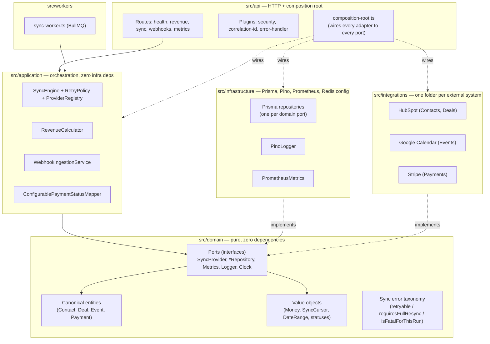

# Architecture

## Layering (Clean / Hexagonal)

**The rule dependency-cruiser enforces** (`.dependency-cruiser.cjs`, checked by
`tests/architecture/dependency-rules.test.ts` on every `npm test` run):

| From                                                | Must not depend on                                      |
| --------------------------------------------------- | ------------------------------------------------------- |
| `src/domain`                                        | application, infrastructure, integrations, api, workers |
| `src/application`                                   | infrastructure, integrations                            |
| `src/integrations`                                  | api, workers                                            |
| anything except `RevenueCalculator`/its Prisma repo | `RevenueRepository` port                                |

Only `src/api/composition-root.ts` and `src/workers/sync-worker.ts` are allowed to know about
every layer at once — that is the composition root's entire job.

## Why this shape

- **Domain has zero dependencies.** Every entity, value object, and port is plain TypeScript.
  Swapping Prisma for a different ORM, or Fastify for another framework, never touches this layer.
- **Application never imports a concrete adapter.** `SyncEngine` calls `SyncProvider`,
  `RevenueCalculator` calls `RevenueRepository` — interfaces, not `HubSpotContactProvider` or
  `PrismaRevenueRepository` by name. New providers are additive: implement the port, register it
  in the composition root, nothing else changes.
- **Integrations are leaf nodes.** `src/integrations/hubspot`, `google-calendar`, `stripe` each
  implement `SyncProvider` and translate their SDK's error types into the shared
  `SyncProviderError` taxonomy (`src/integrations/shared/http-status-error-mapper.ts`) — the sync
  engine only ever reasons about `retryable` / `requiresFullResync` / `isFatalForThisRun` flags,
  never about HTTP status codes or provider-specific exception classes.
- **The composition root is the only place all layers meet** (`src/api/composition-root.ts`).
  Reading it top to bottom is the fastest way to see the whole system wired together.

## The Sync Engine

`SyncEngine.run()` (`src/application/sync/sync-engine.ts`) is the one code path every provider's
data flows through:

1. Try to acquire the per-(provider, entityType) lease lock (`SyncLockPort`) — skip with outcome
   `skipped` if another run is already in flight.
2. Decide incremental vs. full: use the existing cursor unless it's missing or stale
   (`SyncCursor.isStale`).
3. Drain pages via `fetchIncremental`/`fetchFull`, retrying transient errors
   (`RetryPolicy`, exponential backoff + jitter), and falling back to a full backfill mid-run if
   the provider rejects the cursor (`requiresFullResync` flag — this is the reactive counterpart
   to the proactive staleness check in step 2).
4. Normalize + validate each raw record; a bad record is logged and skipped, never aborts the
   batch.
5. Persist the batch and the new cursor atomically (`SyncPersistencePort`, see ADR 0003).
6. Record job history, update the sync-metadata snapshot, emit Prometheus metrics.
7. Never throw — every failure mode becomes a `SyncRunResult`, so `runMany()` (looping over every
   registered provider) is guaranteed to finish the whole list even if one provider is down.

## Revenue Engine

See ADR 0007. One method (`RevenueCalculator.calculate(range, granularity)`) backs all four
`/metrics/revenue*` endpoints; the allow-list (`REVENUE_COLLECTED_STATUSES`) lives in exactly one
domain file and is read in exactly one application-layer file.
