# Database schema

Full rationale for every non-obvious decision is in
[ADR 0002](adr/0002-database-schema.md). This document is the visual reference.

## ER diagram

```mermaid
erDiagram
    PROVIDERS ||--o{ CANONICAL_CONTACTS : provider
    PROVIDERS ||--o{ CANONICAL_DEALS : provider
    PROVIDERS ||--o{ CANONICAL_EVENTS : provider
    PROVIDERS ||--o{ CANONICAL_PAYMENTS : provider
    PROVIDERS ||--o{ SYNC_CURSORS : provider
    PROVIDERS ||--o{ SYNC_LOCKS : provider
    PROVIDERS ||--o{ SYNC_METADATA : provider
    PROVIDERS ||--o{ JOB_HISTORY : provider
    PROVIDERS ||--o{ FAILURE_LOGS : provider
    PROVIDERS ||--o{ WEBHOOK_EVENTS : provider
    PROVIDERS ||--o{ PAYMENT_STATUS_MAPPINGS : provider
    PROVIDERS ||--o{ CANONICAL_RECORD_AUDIT : provider
    JOB_HISTORY ||--o{ FAILURE_LOGS : job_id

    PROVIDERS {
        text id PK
        text source_system "crm | payments | calendar"
        text display_name
        bool enabled
    }

    CANONICAL_CONTACTS {
        text id PK
        text provider FK
        text source_id "UNIQUE with provider"
        text email
        text first_name
        text last_name
        text lifecycle_stage
        timestamp source_updated_at
        jsonb raw
    }

    CANONICAL_DEALS {
        text id PK
        text provider FK
        text source_id "UNIQUE with provider"
        text deal_name
        text stage
        bigint amount_minor "nullable, CHECK >= 0"
        text currency
        timestamp close_date
        jsonb raw
    }

    CANONICAL_EVENTS {
        text id PK
        text provider FK
        text source_id "UNIQUE with provider"
        text title
        timestamp start_at
        timestamp end_at "CHECK end_at >= start_at"
        text status "CHECK confirmed|tentative|cancelled"
        jsonb attendees
        jsonb raw
    }

    CANONICAL_PAYMENTS {
        text id PK
        text provider FK
        text source_id "UNIQUE with provider"
        bigint amount_minor "CHECK >= 0"
        text currency "CHECK ISO-4217 format"
        text raw_status
        text canonical_status "CHECK in allow-list vocabulary"
        timestamp occurred_at
        jsonb raw
    }

    SYNC_CURSORS {
        text provider PK, FK
        text entity_type PK
        text token
        timestamp issued_at
        timestamp expires_at
    }

    SYNC_LOCKS {
        text provider PK, FK
        text entity_type PK
        timestamp locked_at
        text lock_owner
    }

    SYNC_METADATA {
        text provider PK, FK
        text entity_type PK
        text last_sync_status
        text last_sync_mode
        int consecutive_failure_count
    }

    JOB_HISTORY {
        text id PK
        text provider FK
        text entity_type
        text mode
        text outcome
        timestamp started_at
        timestamp finished_at
        int records_fetched
        int records_upserted
        int records_failed
    }

    FAILURE_LOGS {
        text id PK
        text provider FK
        text job_id FK
        text error_code
        text message
        jsonb context
    }

    WEBHOOK_EVENTS {
        text id PK
        text idempotency_key "UNIQUE — the dedup mechanism"
        text provider FK
        text event_type
        jsonb payload
        text processing_status "received|processed|failed"
    }

    IDEMPOTENCY_KEYS {
        text key PK
        text scope PK
        text status "claimed|completed"
        jsonb result
    }

    PAYMENT_STATUS_MAPPINGS {
        text provider PK, FK
        text raw_status PK
        text canonical_status "the configurable allow-list mapping"
    }

    CANONICAL_RECORD_AUDIT {
        text id PK
        text provider FK
        text entity_type
        text source_id
        text operation "created|updated"
        jsonb snapshot
    }
```

## Index rationale (the ones that matter at scale)

| Table                 | Index                                      | Why                                                                                                                                                            |
| --------------------- | ------------------------------------------ | -------------------------------------------------------------------------------------------------------------------------------------------------------------- |
| `canonical_payments`  | `(canonical_status, occurred_at)`          | The exact predicate `RevenueCalculator`'s SQL filters and sorts on — this is what keeps revenue aggregation fast as the table grows into the millions of rows. |
| `canonical_payments`  | `(provider, occurred_at)`                  | Per-provider reporting / debugging without a full scan.                                                                                                        |
| `canonical_contacts`  | `(email)`                                  | Contact lookup by email, the common CRM query shape.                                                                                                           |
| `job_history`         | `(provider, entity_type, started_at DESC)` | Powers `GET /sync/jobs`'s "recent runs for this provider" view.                                                                                                |
| every canonical table | `UNIQUE(provider, source_id)`              | Not just an index — this _is_ the idempotency guarantee (see ADR 0002 and 0003).                                                                               |

## Why raw SQL for revenue aggregation

`PrismaRevenueRepository` (`src/infrastructure/repositories/prisma-revenue.repository.ts`) uses
`$queryRaw` with `date_trunc()` and `SUM()`/`GROUP BY` rather than pulling rows into Node and
summing in JavaScript. At the row counts a real deployment would reach, doing the sum in the
application tier means shipping every matching row over the network for every single API
call — the database is a better calculator than Node for aggregate arithmetic, and it's the only
approach that keeps `/metrics/revenue/*` response times flat as the table grows. All values are
passed through Prisma's tagged-template parameterization (`Prisma.sql`), never string
concatenation, so this is also the SQL-injection-safe way to do it.
