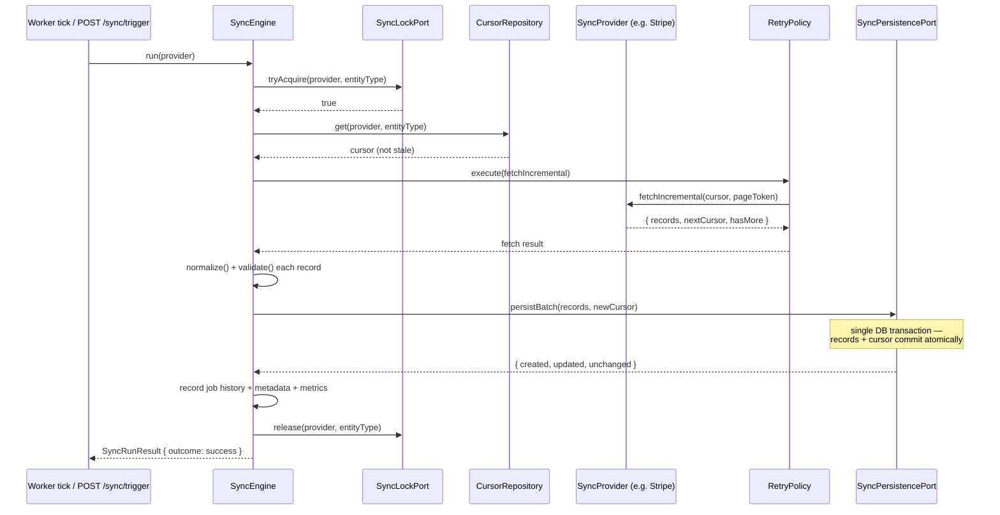
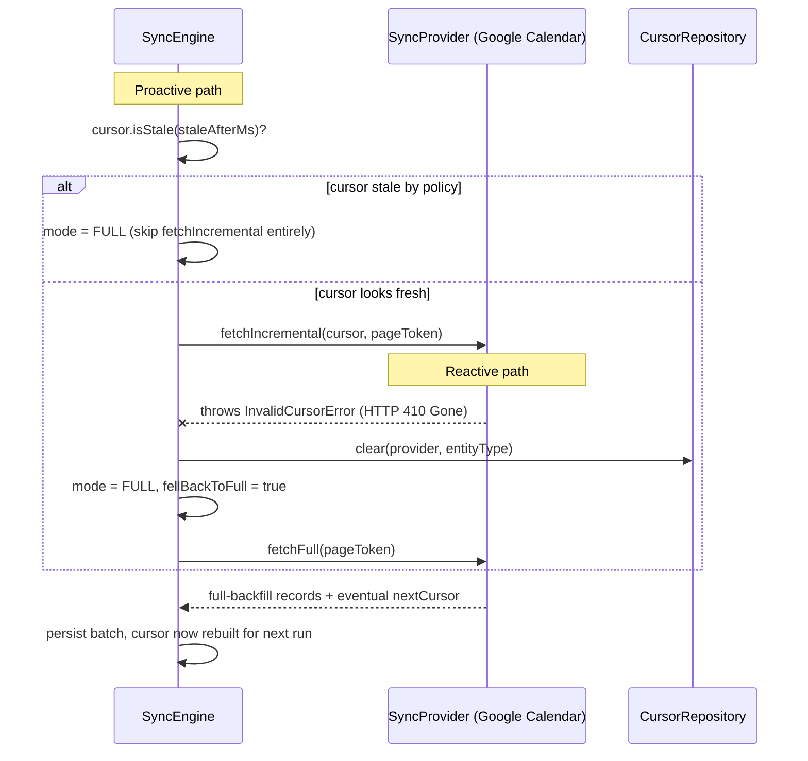
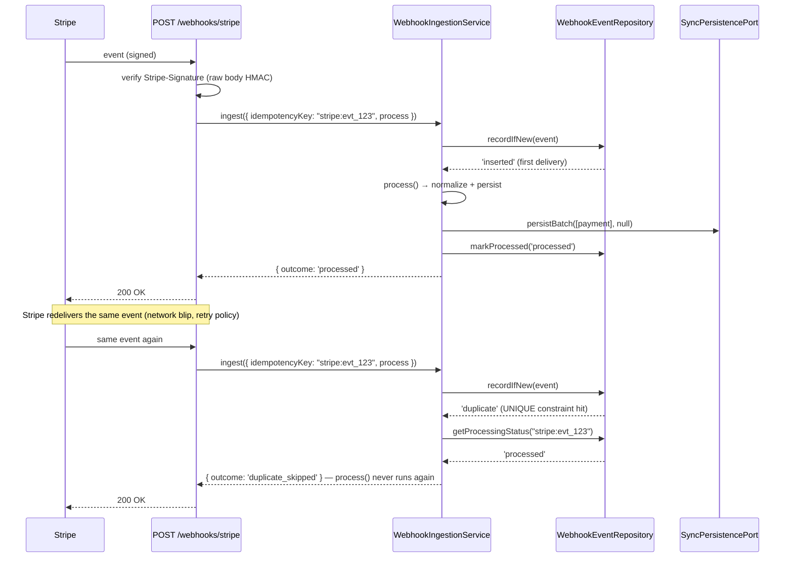
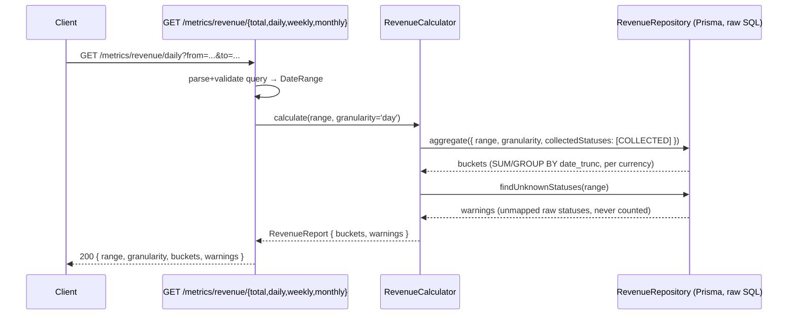

# Sequence diagrams

## 1. Incremental sync, happy path

## 2. Stale/rejected cursor → automatic full-backfill fallback

## 3. Webhook delivery: duplicate-safe processing

## 4. Revenue query — the same method behind every endpoint

